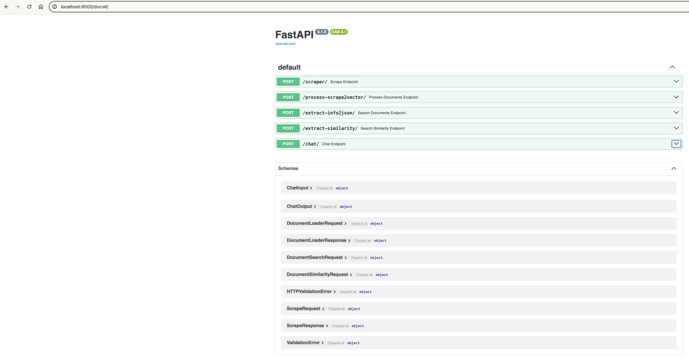
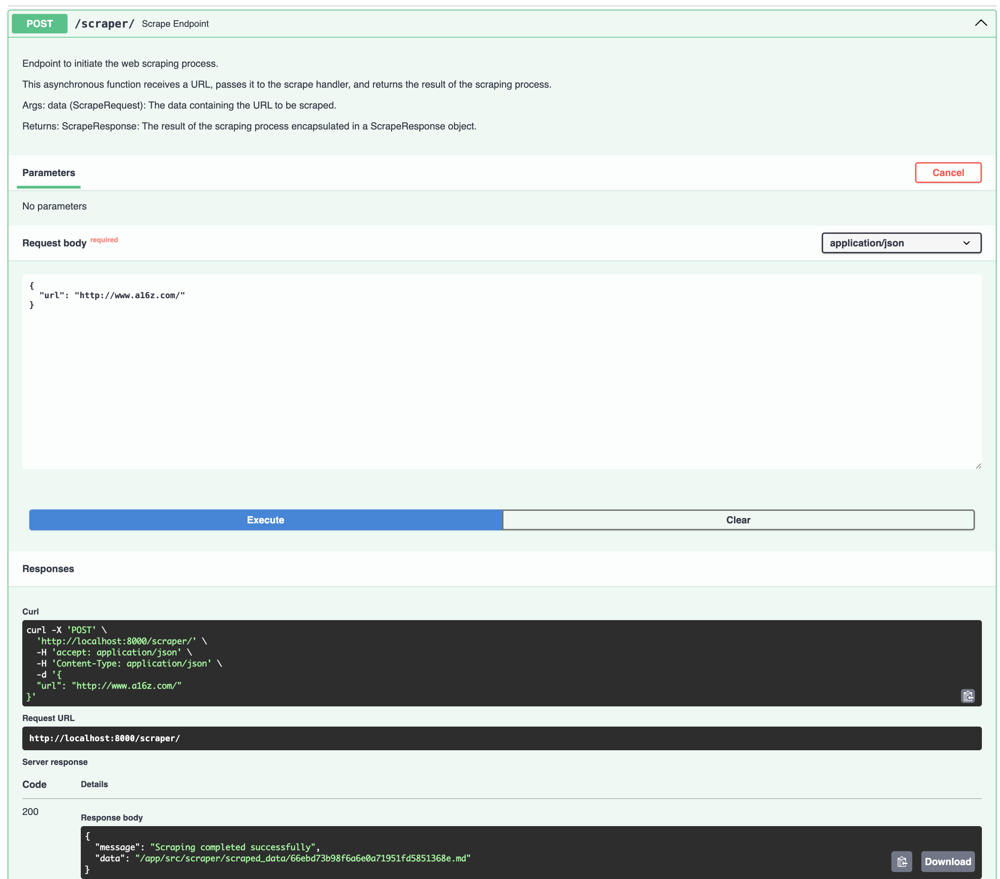
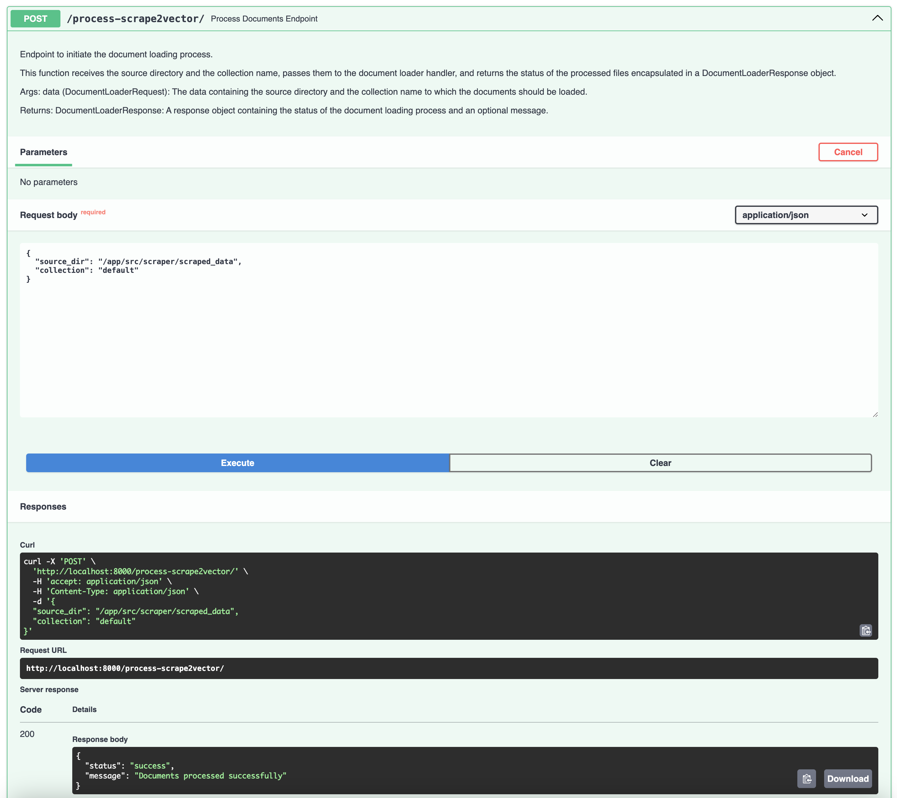
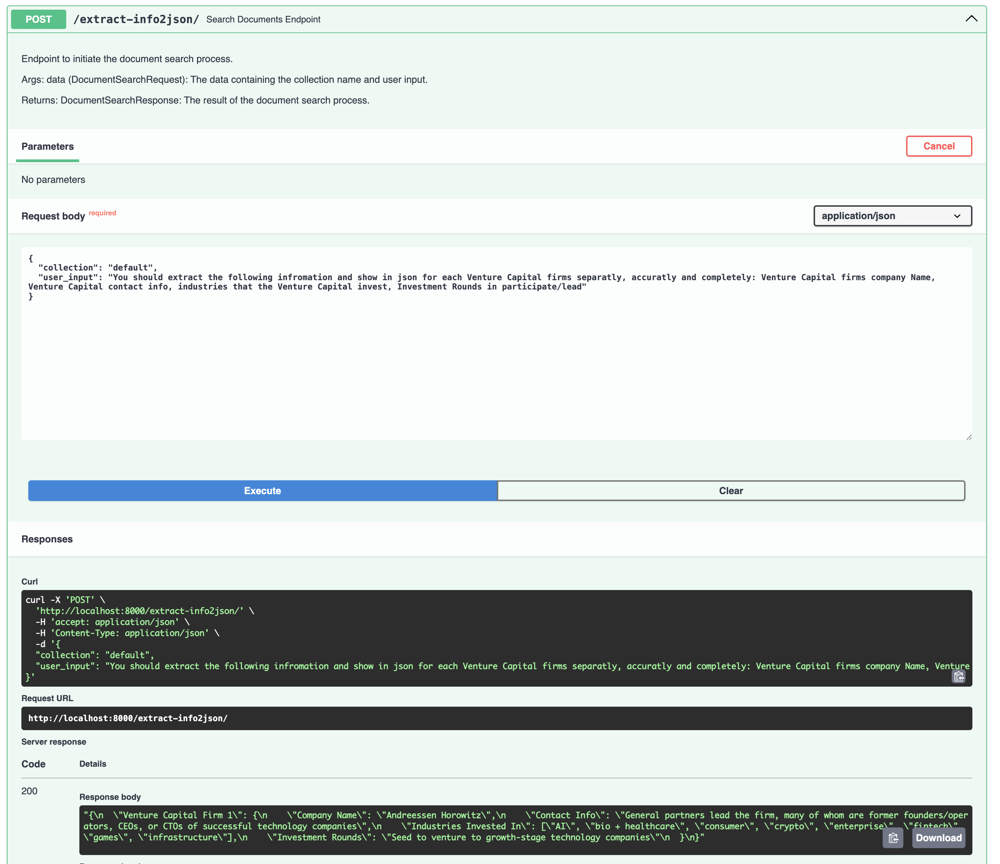

# 🤖 VC_assistant (Venture Capital Assistant)


# Overview
VC_assistant is an adaptive intelligence chatbot designed to facilitate the creation of enterprise applications with advanced conversational capabilities for Venture Capital info scraping , embedding , storing in vectordatabase, extract special content in JSON format and find similarity. It leverages a tool-using agentic architecture and retrieval augmented generation (RAG) to integrate state-of-the-art open-source frameworks such as LangChain, FastAPI and etc. This document outlines the architecture, components, and use cases of VC_Assistant, providing a comprehensive understanding of its functionality and deployment.


# Main Features:
### Given VC website URL as an input by the user, your Generative AI assistant should be able to:
<br />


<br>
## Scrape Home page of the website and store the content in vectorDB of your choice,





<br>

## Extract the following information and show it to the user as a JSON object: VC name,contacts, industries that they invest in, investment rounds that they participate/lead.

## Compare VC website content to the other VC website contents in the database.

<br><br><br>


# Prerequisites

To use this project, you will need:

- Docker and Docker Compose installed  
- Python 3.7+
- An OpenAI API key

# Setup  

To set up the project:

1. Clone this repository to your local machine.

2. Rename `key.env.example` to `key.env` and add your OpenAI API key.  

3. Review `config.yml` and choose `openai` or `local` for your `Embedding_Type`

4. In `docker-compose.yml`, update the `volumes` path for `VC_ASSISTANT_QDRANT` to a local folder where you want persistent storage for the vector database.

5. Create needed directories for persistant storage
   ```bash
   mkdir -p .data/qdrant/
   ```

6. Build the Docker images:
   ```bash
    docker-compose build
    ```
7. Start the services:
   ```bash
   docker-compose up -d
   ```
The services will now be running.


##  **Deployment and Usage**
Once the Docker containers are up and running, you can start interacting::

- The **interactive Swagger docs** at [http://localhost:8000/docs](http://localhost:8000/docs)
- The **Qdrant Web Interface** at [http://localhost:6333/dashboard](http://localhost:6333/dashboard)

### Build the default Collection
1. **Scrape Documents:**
    - Go to the FastAPI server by navigating to the interactive Swagger docs at [http://localhost:8000/docs](http://localhost:8000/docs).
    - Use the `scraper` endpoint to scrape content from a specified URL. You will need to provide the URL you want to scrape in the request body.
    - The `scraper` endpoint will return the scraped content which will be processed in the next step.


2. **Create a Vector Index:**
    - Use the `process-scrape2vector` endpoint to create a vector index from the scraped content.
    - In case the `default` collection does not exist, the `process-scrape2vector` endpoint will create one for you.
    - This endpoint will process the scraped documents, create a vector index, and load it into Qdrant.


## Architecture Overview

The VC_Assistant architecture consists of the following key components:

- FastAPI - High performance REST API framework. Handles HTTP requests and routes them to application logic.
- Qdrant - Vector database for storing document embeddings and enabling similarity search.
- AgentHandler - Orchestrates the initialization and execution of the conversational agent.
- Scraper - A tool that scrapes a web page and converts it to markdown.
- Loader - A tool that loads content from the scrped_data directory to a VectorStoreIndex
- Tools - Custom tools that extend the capabilities of the agent.

## Infrastructure
Let's take a closer look at some of the key VC_assistant infrastructure components:

### FastAPI
FastAPI provides a robust web framework for handling the API routes and HTTP requests/responses.

Some key advantages:

- Built on modern Python standards like type hints and ASGI.
- Extremely fast - benchmarked to be faster than NodeJS and Go.
- Automatic interactive docs using OpenAPI standards.


### Qdrant
Qdrant is a vector database optimized for ultra-fast similarity search across large datasets. It is used in this project to store and index document embeddings, enabling the bot to quickly find relevant documents based on a search query or conversation context.


### Document Scraping Section

The `scraper` module, located in `/app/src/scraper/scraper_main.py`, serves as a robust utility for extracting content from web pages and converting it into structured markdown format. This module is integral for enabling the framework to access and utilize information from a plethora of web sources. Below is a succinct overview focusing on its core functionalities and workflow for developers aiming to integrate and leverage this module effectively.

#### Components:
- **WebScraper Class:**
  - Inherits from the base Scraper class and implements the Singleton pattern to ensure a unique instance.
  - Orchestrates the entire scraping process, from fetching to parsing, and saving the content.
  - Leverages `ContentParser` to extract and convert meaningful data from HTML tags into markdown format.

- **ContentParser Class:**
  - Designed to parse and convert meaningful content from supported HTML tags into markdown format.
  - Supports a variety of HTML tags including paragraphs, headers, list items, links, inline code, and code blocks.

#### Workflow:

1. **URL Validation:**
   - The provided URL undergoes validation to ensure its correctness and accessibility.
   - If the URL is invalid, the process is terminated, and an error message is logged.

2. **Content Fetching:**
   - Content from the validated URL is fetched using HTTP requests.
   - Utilizes random user agents to mimic genuine user activity and avoid potential blocking by web servers.
   - If the content fetching fails, the process is halted, and an error message is logged.

3. **Content Parsing:**
   - The fetched content is parsed using BeautifulSoup, and the `ContentParser` class is employed to extract meaningful data.
   - The parsed data includes the title, metadata, and the content in markdown format.

4. **File Saving:**
   - The parsed content is saved to a file, the filename is generated using a hash of the URL.
   - The file is stored in a pre-configured data directory.
   - If the file saving fails, an error message is logged.

5. **Result Return:**
   - Upon the successful completion of the scraping process, a success message and the filepath of the saved content are returned.
   - If any step in the process fails, an appropriate error message is returned.

#### Usage:
Developers can initiate the scraping process by invoking the `run_web_scraper(url)` function with the desired URL. This function initializes a `WebScraper` instance and triggers the scraping process, returning a dictionary containing the outcome of the scraping process, including messages indicating success or failure and the location where the scraped data has been saved.

#### Example:
```python
result = run_web_scraper("http://example.com")
if result and result.get("message") == "Scraping completed successfully":
    print(f"Scraping complete! Saved to {result['data']}")
else:
    print(result["message"])
```


